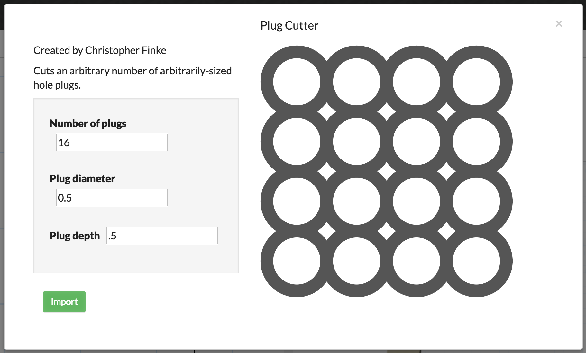
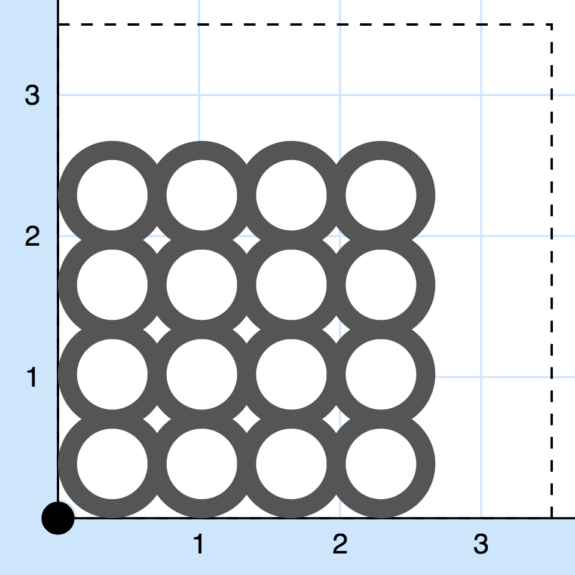
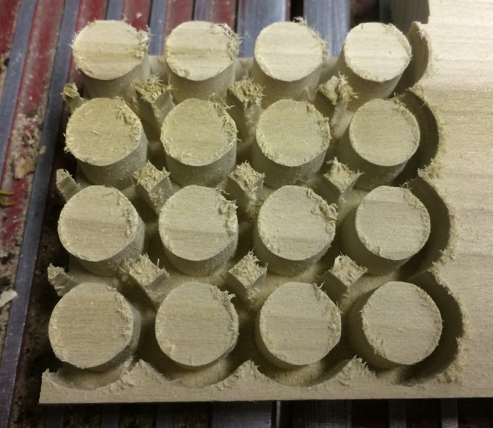

Plug Cutter
===========
An app for automating the process of cutting hole plugs with Inventables's Easel CNC design platform.

Choose how many plugs you want to cut and how big you want them, and the app will lay them out in your workspace, spaced as tightly together as possible.

This app replaces an infinite number of plug cutters, which can cost $40 for a set of three: https://www.amazon.com/dp/B0014A450G/

Example
=======

